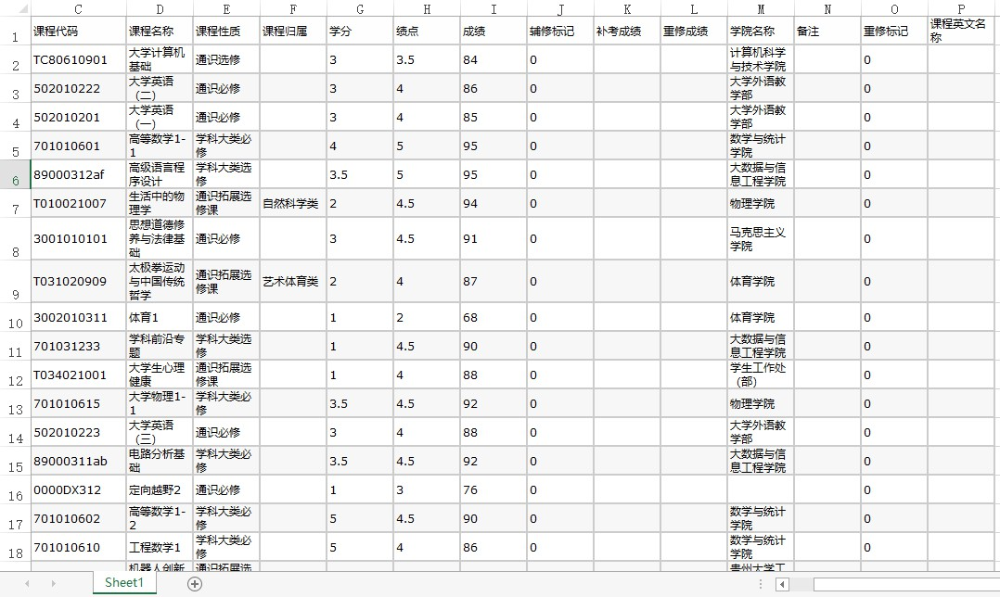

# ScoreEvaluation

模块学分统计工具
现在您可直接在百度云下载已编译好的exe可执行文件: 

链接: https://pan.baidu.com/s/1B8Ras8oNrCq-KMDzvqm28w 提取码: 3s83

目前该编译版本在Win10-64位系统测试运行成功. 由于程序中使用了未精简的库, 所以体积较大, 未来会进行精简. 具体使用方法可参考下方的使用方法.

<!-- TOC -->

- [ScoreEvaluation](#scoreevaluation)
    - [说明](#说明)
        - [环境](#环境)
        - [目前支持的培养方案](#目前支持的培养方案)
        - [Update](#update)
    - [使用方法](#使用方法)
        - [已编译的可执行版本](#已编译的可执行版本)
        - [命令行工具示例](#命令行工具示例)
        - [培养方案的准备和成绩单的准备](#培养方案的准备和成绩单的准备)
    - [About](#about)
    - [勘误](#勘误)
        - [通信工程2013版培养方案](#通信工程2013版培养方案)

<!-- /TOC -->

## 说明

本程序具有以下特点和功能:

- 统计个人加权平均分和平均学分绩点
- 统计未修满学分的模块
- 统计超修学分的模块
- 统计总学分是否达到毕业要求
- 自动生成报告
- 支持培养方案个性化定制

### 环境

- python3.6.3-64bit-win32
- package
    - pandas-0.20.3
    - numpy-1.13.3
    - os
    - json-2.0.9
    - argparse-1.1

### 目前支持的培养方案

|方案名|适用专业|版本|适用人群|
|:-|:-|:-|:-|
|tongxingongcheng2013.json|通信工程|2013版|2013-2015级|
|gongchengguanli2013.json|工程管理|2013版|2013-2015级|
|cs16.json|计算机科学与技术|2016版|2016级计科专业本科生|
|jinrong2016.json|金融学|2016版|2016级金融学及以后|

### Update

- 2018/10/23 加入工程管理2013版和计科16版培养方案
- 2018/10/26 加入金融学2016版培养方案

## 使用方法

### 已编译的可执行版本

- 首先在`score.exe`文件所在目录打开`cmd`或`powershell`, 具体方法是在当前文件夹按住`shift`键后单击鼠标右键, 点击打开`powershell`
- 在命令行中输入命令`score.exe ls`查看目前支持的培养方案, 选中培养方案名字(如`cs16.json`)后单击鼠标右键即可复制
- 在命令行中输入命令`score.exe <你复制的培养方案配置文件> <你的成绩单>`即可导出成绩
    - 工程管理导出示例: `score.exe gongchengguanli2013.json score.xlsx`, 其中`score.xlsx`是你的成绩单名称
- 在导出的`report.txt`中查看报告

### 命令行工具示例

```python
python score.py ls # 列出所有支持的培养方案
python score.py <培养方案名> <成绩单文件名> # 生成报告
# 生成报告的例子:
python score.py tongxingongcheng2013.json score.xlsx
```

### 培养方案的准备和成绩单的准备

- 目前系统已录入通信13版培养方案, 在`./programs/tongxingongcheng2013.json`中, 请自行添加培养方案的同学严格按照该格式进行修改
- 成绩单一定要从教务系统的在校所有成绩中粘贴至excel文档中, 一定要有字段名, 如`成绩`, `学分`等等. 具体格式如下


## About

- 作者
    - Spico (通信13版) `spico1026@gmail.com`
- 鸣谢
    - Yaphet (计科16版) `yaphetliu@foxmail.com`
    - 柚子 (工程管理13版) `2732830541@qq.com`
    - Eyuan (金融学16版) `549155139@qq.com`

## 勘误

### 通信工程2013版培养方案

由于教务系统对于课程归属的认定与培养方案中存在偏差, 故目前出现的问题有:

- 培养方案的`第二课堂必修`模块中出现`形势与政策实践`课程, 但通信15级并未开这门课
- 培养方案中的`第二课堂选修`模块请同学们按照培养方案自行进行统计
- `个性选修课`模块中还差6个学分, 由大四上半学期的`无线网络技术`, `网络程序设计` 和 `网络工程`补充. 请千万不要挂科
- 程序中显示`实践教学环节`还差2个学分, 是因为`大学物理实验3`这门课在教务系统中被认定为`学科大类必修`, 所以请同学们自行校对该课程
- 培养方案中`专业必修课`模块中的`电路及电子技术`和`电路及电子技术实验`课程未开, 所以少了5个学分
- `专业选修`模块中还差的8个学分将由大四上半学期的`移动通信`, `光纤通信`和`嵌入式系统原理及应用`课程补充, 请同学们千万不要挂科
